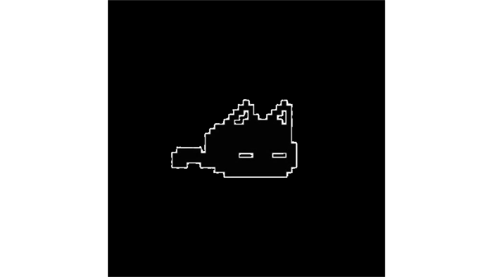
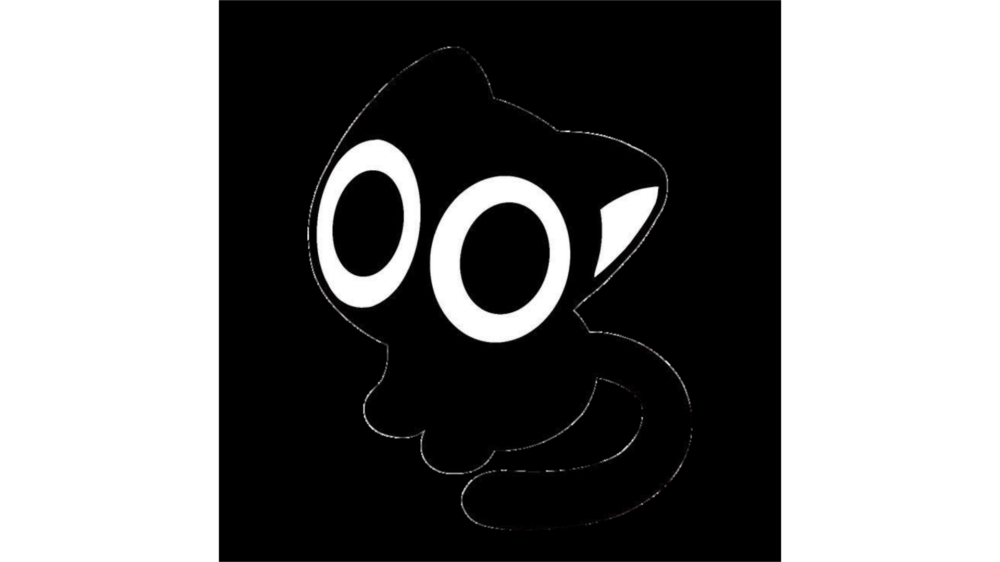

<!-- BANNER SUPERIOR -->

  

  

---

 

 

Desenvolvedora em formação com foco em Front-End, UI/UX e experiências digitais minimalistas. Tenho interesse em interfaces modernas, animações e organização visual, buscando criar projetos que unam estética, funcionalidade e identidade visual.

Além da programação, encontro inspiração em música, fotografia, arte e narrativas visuais — principalmente em experiências com atmosferas mais cinematográficas e conceituais.

Atualmente estudo desenvolvimento web enquanto exploro formas de transformar criatividade e design em experiências interativas.

  

---

  

  

---

 

 

 

  

---

  

  

𝑺𝒕𝒊𝒍𝒍 𝒔𝒂𝒊𝒍𝒊𝒏𝒈 𝒕𝒉𝒓𝒐𝒖𝒈𝒉 𝒃𝒖𝒈𝒔 𝒂𝒏𝒅 𝒔𝒕𝒐𝒓𝒎𝒔.

 

<!-- BANNER INFERIOR -->

